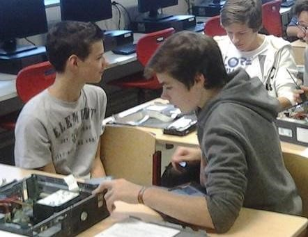

+++
date = "2015-12-06T20:13:38+01:00"
draft = true
title = "Engels"

+++

My name is Tom Dams. I’m 16 years old and I live in Westmalle. I go to school in Oostmalle at the Immaculata Instituut.

My first experiences with IT were the IT lessons in primary school. The first time was when I was 6 years old. We would just go on sites where we could play games to train spelling, basic math and much more. I remember the first time we had IT lessons in primary school and I instantly fell in love with computers. I also had a computer at my home on which I would play games after school with my brother. The computer had Windows XP and we actually still have it in our living room but we don’t really use it anymore. I’d also go on YouTube to watch funny videos when I was bored but I didn’t really go on any other sites.

Now IT is a pretty big part of my life. I spend multiple hours on my computer everyday playing games, working for school, going on social media, watching series or movies on Netflix or just listening to music. I haven’t achieved too much yet, I mostly just play games with my friends but I assembled my own computer this summer. Before I did that I used to think assembling your own computer was really difficult but in hindsight it’s not that hard and actually a really fun experience. It did take a few hours to complete but it was worth it. I think there is an evolution in my IT skills because you learn stuff every day when you go on your computer. I think I’m above average when it comes to IT but I’m sure I can’t call myself an expert yet, there is still room for improvement.

My future prospect with IT is that I’m going to study system and network management and hopefully will get a job in that sector, because that’s my ambition with IT. Programming is really fun too but I think system- and network management is way more fun than programming. I also think getting a job in the IT sector is quite fun since it’s not always the same thing since everything in IT changes pretty quick.
So my life is pretty intertwined with my PC since I study IT. I have to work a lot on my PC for school, but I also go on my PC for my own enjoyment and to talk to my friends. IT has become quite a big and important part of my life and probably will become an even bigger part of my life if I get a job in the IT sector, but I enjoy it so that’s not a bad thing.
